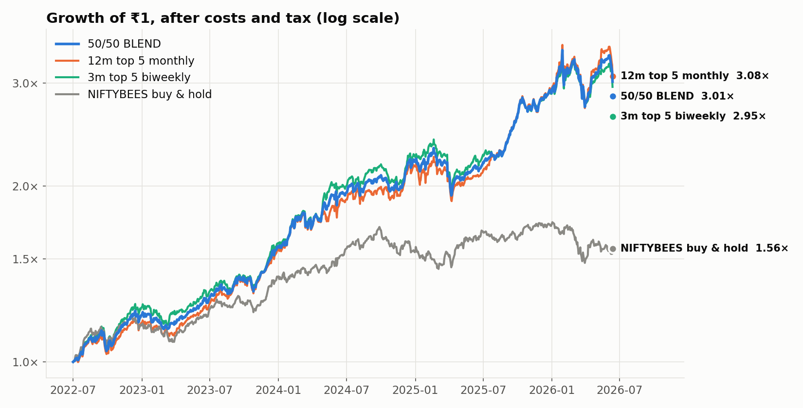
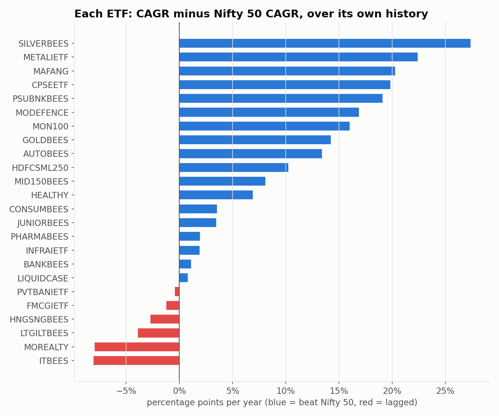
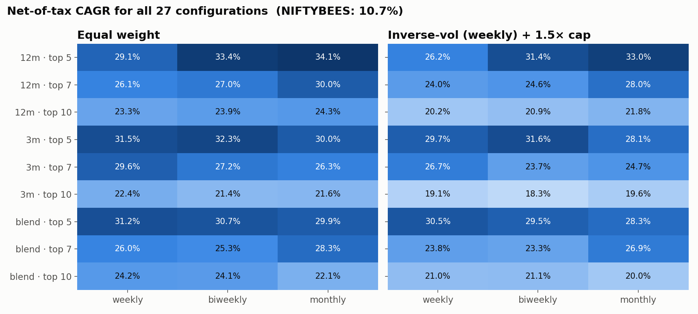
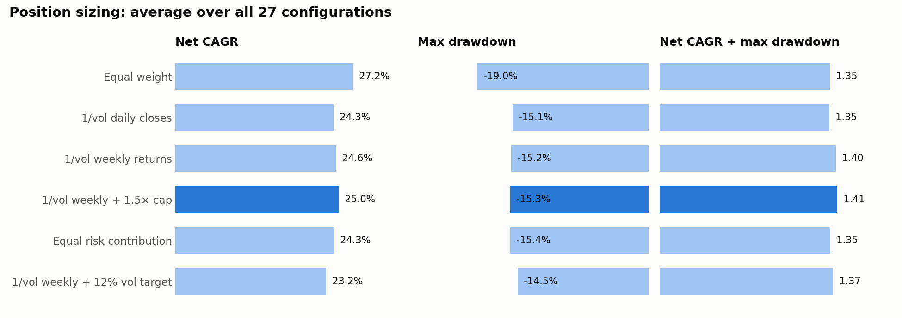
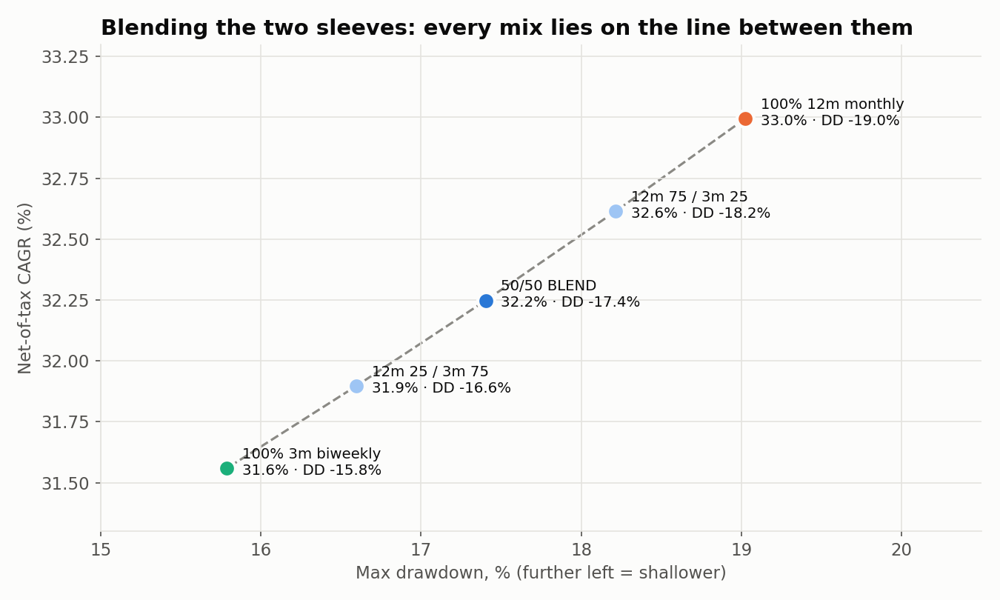
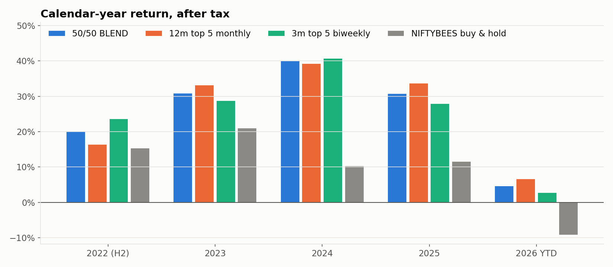
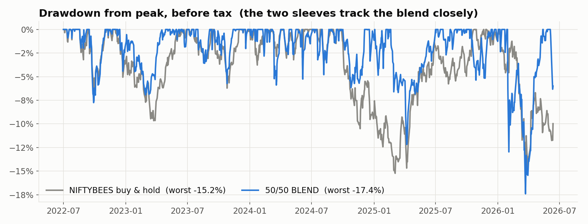
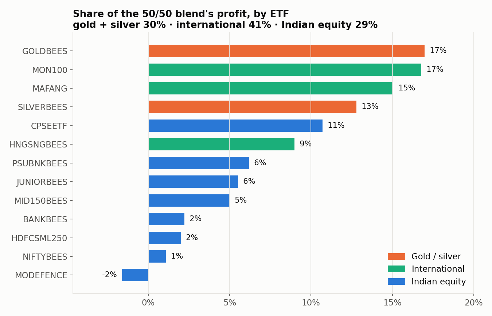

# ETF Momentum Rotation on NSE

A cross-sectional momentum strategy on 25 NSE-listed ETFs: each period, rank the
ETFs by past return, hold the strongest few, and rotate. This covers the whole
research path: the ETF universe, a 27-configuration parameter grid, position
sizing by volatility, a two-sleeve blend and control tests, all compared against
buying and holding **NIFTYBEES**.

**Backtest period:** July 2022 – June 2026 (about 4 years, daily data)



## Summary

| Portfolio | Net CAGR (after tax) | CAGR before tax | Sharpe | Max drawdown | ₹1 became |
|---|---|---|---|---|---|
| **50/50 blend (selected)** | **32.2%** | 40.0% | 2.34 | -17.4% | **₹3.02** |
| 12m, top 5, monthly | 33.0% | 40.2% | 2.18 | -19.0% | ₹3.08 |
| 3m, top 5, biweekly | 31.6% | 39.9% | 2.35 | -15.8% | ₹2.95 |
| NIFTYBEES buy & hold | 10.7% | 11.9% | 1.04 | -15.2% | ₹1.56 |

The selected model splits capital 50/50 between two momentum sleeves:

| | Sleeve A | Sleeve B |
|---|---|---|
| Ranking | 12-month return | 3-month return |
| Holdings | top 5 | top 5 |
| Rebalance | monthly | every 2 weeks |
| Sizing | 1/volatility, capped | 1/volatility, capped |

**Read these caveats before the numbers:**
- **The sample is short.** It is about 4 years and covers one market cycle.
- **Profit is concentrated.** About **71% of the profit came from gold, silver and international ETFs**, during an unusually strong run for them. On Indian equity ETFs alone, the blend earned 16.0% net, still ahead of NIFTYBEES, but half the headline figure.
- **The blend is a compromise, not a diversifier.** Its two sleeves correlate 0.87. See [section 6](#6-the-5050-blend).

---

## Contents
1. [ETF universe](#1-etf-universe)
2. [Strategy rules](#2-strategy-rules)
3. [Parameter grid: lookback × holdings × rebalance](#3-parameter-grid)
4. [Turnover, costs and tax](#4-turnover-costs-and-tax)
5. [Volatility-based position sizing](#5-volatility-based-position-sizing)
6. [The 50/50 blend](#6-the-5050-blend)
7. [Controls: is it real?](#7-controls-is-it-real)
8. [Data problems found and fixed](#8-data-problems-found-and-fixed)
9. [Conclusion](#9-conclusion)

---

## 1. ETF universe

The 25 ETFs:

| Category | ETFs |
|---|---|
| Broad market | NIFTYBEES (Nifty 50), JUNIORBEES (Next 50), MID150BEES (Midcap 150), HDFCSML250 (Smallcap 250) |
| Sectors & themes | AUTOBEES, BANKBEES, PSUBNKBEES, PVTBANIETF, ITBEES, FMCGIETF, CONSUMBEES, PHARMABEES, HEALTHY, INFRAIETF, METALIETF, MOREALTY, MODEFENCE, CPSEETF |
| Commodities | GOLDBEES, SILVERBEES |
| Debt & liquid | LTGILTBEES (8–13 yr G-Sec), LIQUIDCASE (overnight rate) |
| International | MON100 (Nasdaq 100), MAFANG (NYSE FANG+), HNGSNGBEES (Hang Seng) |



Each ETF is measured over its own history since June 2021, against NIFTYBEES over the same dates:

| ETF | Start | Turnover ₹Cr/day (60d) | CAGR | Max DD | vs Nifty 50 (pp/yr) | Correlation with Nifty |
|---|---|---|---|---|---|---|
| SILVERBEES | 2022-02 | 901 | 35.7% | -45.0% | +27.4 | 0.18 |
| MAFANG | 2021-06 | 4.6 | 29.8% | -43.7% | +20.3 | 0.32 |
| CPSEETF | 2021-06 | 16 | 29.4% | -27.9% | +19.9 | 0.56 |
| PSUBNKBEES | 2021-06 | 33 | 28.6% | -30.1% | +19.1 | 0.64 |
| MON100 | 2021-06 | 27 | 25.5% | -28.5% | +16.0 | 0.43 |
| GOLDBEES | 2021-06 | 480 | 23.8% | -24.4% | +14.3 | 0.08 |
| AUTOBEES | 2022-01 | 8.6 | 22.1% | -28.3% | +13.4 | 0.76 |
| MID150BEES | 2021-06 | 30 | 17.6% | -21.2% | +8.1 | 0.76 |
| JUNIORBEES | 2021-06 | 41 | 13.0% | -25.9% | +3.5 | 0.80 |
| BANKBEES | 2021-06 | 76 | 10.6% | -20.6% | +1.1 | 0.86 |
| **NIFTYBEES** | 2021-06 | 286 | **9.5%** | **-16.1%** | — | 1.00 |
| LTGILTBEES | 2021-06 | 6.0 | 5.6% | -8.0% | -3.9 | 0.14 |
| HNGSNGBEES | 2021-06 | 9.1 | 6.7% | -40.9% | -2.8 | 0.22 |
| ITBEES | 2021-06 | 59 | 1.4% | -38.8% | -8.1 | 0.59 |

14 of the 25 are shown here; the chart above covers all 25.

**What matters for a rotation strategy:**
- **Gold, silver, gilt, liquid and the international ETFs barely move with Nifty 50** (correlation 0.1–0.4). That mix is what lets rotation dodge Indian equity drawdowns.
- **Three ETFs are too thin to trade.** CONSUMBEES (₹1.6 Cr/day), HEALTHY (₹0.7 Cr/day) and INFRAIETF (₹1.6 Cr/day) are usually below the liquidity floor, so the strategy rarely buys them.

---

## 2. Strategy rules

| Rule | Detail |
|---|---|
| Ranking | Return over the lookback (12 months = 252 bars, 3 months = 63 bars). "Blend" averages the two percentile ranks. |
| No look-ahead | Rankings use closes up to the previous day; trades fill at the **open** of the rebalance day. |
| New ETFs | An ETF can only be ranked once it has a full lookback of its own history. |
| Liquidity floor | 60-day average of close × volume must be at least **₹3 Cr/day**, measured on the previous day. |
| Holdings | The top N by rank. If fewer than N are eligible, the empty slots stay in cash. |
| Rebalance | Weekly, biweekly or monthly, on the first trading day of the period. Positions are reset to target weights. |
| Costs | **0.10% per side** on traded value (brokerage, stamp duty, STT, bid-ask spread). |
| Tax | Indian capital-gains tax: **20% short-term** (held < 365 days), **12.5% long-term**. Uses first-in-first-out lots, nets losses and carries them forward, and is deducted at each financial year-end (April–March). The ₹1.25L long-term exemption is ignored. |
| Price cleaning | NSE price downloads are **not** split-adjusted. Splits are back-adjusted and bad ticks removed before anything else. |
| Benchmark | NIFTYBEES bought on day 1 and held; sold at the end with 12.5% long-term tax on the gain. |

Liquid and gilt ETFs are ranked like any other ETF. When equities fall, they rise up the ranking, so the strategy moves into them without needing a separate market-timing rule.

---

## 3. Parameter grid

27 configurations: **{12-month, 3-month, blended} ranking × {top 5, 7, 10} × {weekly, biweekly, monthly}**.



**All 27 beat NIFTYBEES by a wide margin**: net CAGR 21–34% with equal weight, 18–33% with capped vol weights, against 10.7%.

Averages across the grid, equal weight:

| Choice | Net CAGR | Max DD | Turnover/yr |
|---|---|---|---|
| Top 5 | 31.4% | -22.0% | 4.8× |
| Top 7 | 27.3% | -18.8% | 4.4× |
| Top 10 | 23.0% | -16.1% | 3.4× |
| Weekly | 27.0% | -17.8% | 5.8× |
| Biweekly | 27.2% | -18.9% | 4.1× |
| Monthly | 27.4% | -20.3% | 2.7× |

- **The number of ETFs held is the real lever.** It trades return against drawdown in a clear, steady way.
- **Rebalance frequency hardly matters for return**, but it drives costs and tax (next section).
- **The lookback matters little.** 12-month, 3-month and blended rankings average within about a point of each other.

---

## 4. Turnover, costs and tax

**Turnover/yr** is how many times a year the whole portfolio is replaced: value traded ÷ 2 ÷ average portfolio value ÷ years.

Here are the two best configurations, broken down step by step:

| | Before costs | Costs | Before tax | Tax | **After tax** | Turnover | Gains taxed long-term |
|---|---|---|---|---|---|---|---|
| 12m, top 5, monthly | 41.6% | -0.6 pp | 41.0% | -6.9 pp | **34.1%** | 2.1× | 37% |
| 3m, top 5, weekly | 41.8% | -2.2 pp | 39.6% | -8.1 pp | 31.5% | 8.1× | 0% |

(Equal weight.)

**Weekly rebalancing earned the same before costs and lost after them:**
1. Before costs, the two were level (41.8% vs 41.6%).
2. Trading 4× as often cost 2.2 points a year in costs, against 0.6.
3. None of weekly's gains were held a year, so all were taxed at 20%. In the monthly version, 37% of gains qualified for the 12.5% long-term rate.

Weekly finished 2.6 points a year behind, and that assumes a 0.10% cost per trade. Real bid-ask spreads on thinner ETFs are often wider, which would widen the gap.

---

## 5. Volatility-based position sizing

### How inverse-volatility weighting works

Each pick gets weight ∝ 1/volatility, and the weights are scaled to sum to 100%.

Real example, the 2026-06-01 rebalance (12-month ranking, top 5):

| ETF | Vol (26-week) | 1/vol | Weight |
|---|---|---|---|
| SILVERBEES | 54.0% | 1.85 | **9.2%** |
| MON100 | 22.5% | 4.44 | 22.2% |
| GOLDBEES | 22.0% | 4.54 | 22.7% |
| MAFANG | 22.9% | 4.37 | 21.8% |
| METALIETF | 20.7% | 4.83 | 24.1% |
| **Sum** | | **20.03** | **100%** |

Equal weight would give each ETF 20%. Silver moves about 2.5× as much as the others, so it gets about 2.5× less money. Each ETF then adds roughly the same risk to the portfolio.

### Measuring vol from daily closes is unreliable for ETFs

NSE ETF closes can be distorted by thin trading, bid-ask bounce, stale prices, and gaps where an ETF catches up to an overnight move abroad:

| ETF | Vol from daily closes | Vol from weekly returns | Ratio | Days with unchanged close |
|---|---|---|---|---|
| LIQUIDCASE | 0.30% | 0.17% | 1.80 | 51 |
| **GOLDBEES** | **19.4%** | **15.2%** | **1.28** | 17 |
| SILVERBEES | 35.6% | 30.1% | 1.18 | 14 |
| LTGILTBEES | 3.1% | 2.9% | 1.07 | 125 |
| NIFTYBEES | 11.7% | 11.5% | 1.02 | 7 |

- **Gold's daily vol is overstated by 28%.** Gold's price is set abroad overnight, and the Indian ETF catches up the next day. Daily-close sizing was underweighting gold for that reason.
- **The worst one-day spikes were real.** The big gold and silver reversals of January–March 2026 came on 30–60× normal volume. Those were genuine crash days, not bad data.

**Fix:** measure vol from **Friday-to-Friday returns over 26 weeks**. That sidesteps bid-ask bounce, stale closes and one-day gaps. Vol is floored at **10%**, so the liquid ETF (vol about 0.3%) can't take over the portfolio.

### Five sizing methods tested on all 27 configurations



| Method | Net CAGR | Max DD | Sharpe | Net CAGR ÷ max DD | Beats equal weight (return ÷ drawdown) |
|---|---|---|---|---|---|
| Equal weight | **27.2%** | -19.0% | 2.01 | 1.35 | — |
| 1/vol, daily closes | 24.3% | -15.1% | 2.11 | 1.35 | 11 / 27 |
| 1/vol, weekly returns | 24.6% | -15.2% | 2.10 | 1.40 | 18 / 27 |
| **1/vol, weekly + 1.5× cap** | 25.0% | -15.3% | 2.11 | **1.41** | **22 / 27** |
| Equal risk contribution | 24.3% | -15.4% | 2.11 | 1.35 | 12 / 27 |
| 1/vol, weekly + 12% vol target | 23.2% | **-14.5%** | 2.12 | 1.38 | 15 / 27 |

The **1.5× cap** means no ETF can hold more than 1.5× its equal weight: 30% when holding 5.

- **Vol sizing lowers risk; it doesn't add return.** Drawdown improves about 4 points, and return drops about 2–3 points.
- **Weekly vol beats daily vol**, which confirms the noise problem above is real in practice.
- **The cap is the best simple addition.** It beats equal weight on Sharpe and drawdown in 27 of 27 configurations.
- **Equal risk contribution (correlation-aware) didn't help.** It sees that gold and silver move together (weekly correlation 0.77), but a covariance matrix estimated from 26 weekly points is too noisy to use.
- **Its main use is holding fewer ETFs at the same drawdown.** 3m, top 5, biweekly with capped vol weights nets 31.6% at a -15.8% drawdown. Equal-weighting ten ETFs averages 23.0% at -16.1%.

---

## 6. The 50/50 blend

The two best capped vol-weighted configurations were blended by splitting capital. Each sleeve runs as its own account, and tax is calculated on both sleeves' trades together, so losses in one offset gains in the other.



| Mix (12m monthly / 3m biweekly) | Net CAGR | Sharpe | Max DD | Net CAGR ÷ max DD | Gains taxed long-term |
|---|---|---|---|---|---|
| 100 / 0 | **33.0%** | 2.18 | -19.0% | 1.50 | 29% |
| 75 / 25 | 32.6% | 2.27 | -18.2% | 1.55 | 21% |
| **50 / 50 (selected)** | **32.2%** | **2.34** | **-17.4%** | **1.61** | **14%** |
| 25 / 75 | 31.9% | 2.36 | -16.6% | 1.67 | 7% |
| 0 / 100 | 31.6% | 2.35 | **-15.8%** | **1.74** | 0% |

**Why every mix falls on a straight line:**
- **The sleeves overlap heavily.** On an average day they share **3 of their 5 ETFs**.
- **Their returns correlate 0.87**, daily and monthly.
- **They lose together.** In 47 months, both lost in 10; only one lost in just 4.

The blend is therefore an **average** of the two sleeves, not a diversification gain. The NSE stock-momentum blend worked because its sleeves correlated only 0.65 and held different stocks.

It was selected as a **middle ground between the two sleeves**:
- It keeps most of the 12m sleeve's after-tax return (32.2% vs 33.0%).
- It keeps part of the 3m sleeve's shallower drawdown (-17.4% vs -19.0%).
- It keeps some long-term-taxed gains (14%).



| After-tax return by year | 2022 (H2) | 2023 | 2024 | 2025 | 2026 YTD |
|---|---|---|---|---|---|
| **50/50 blend** | **20.1%** | **31.0%** | **40.1%** | **30.8%** | **4.7%** |
| 12m, top 5, monthly | 16.5% | 33.2% | 39.3% | 33.7% | 6.6% |
| 3m, top 5, biweekly | 23.7% | 28.9% | 40.8% | 28.0% | 2.8% |
| NIFTYBEES | 15.4% | 21.0% | 10.4% | 11.7% | -9.3% |

The blend beat NIFTYBEES in every calendar year.



**Drawdown:** the blend's worst drop (-17.4%, March 2026, during the gold and silver crash) was **deeper than NIFTYBEES' worst (-15.2%)**. It recovered in 7 weeks, by 2026-05-13, and otherwise stayed much closer to its peak:

| | Worst drawdown | Average drawdown | Days more than 5% below peak | Longest time below a previous peak |
|---|---|---|---|---|
| 50/50 blend | -17.4% | -2.1% | 15% | 86 trading days |
| NIFTYBEES | -15.2% | -3.8% | 29% | 262 trading days |

---

## 7. Controls: is it real?

| Test | Net CAGR | Before tax | Sharpe | Max DD |
|---|---|---|---|---|
| **50/50 blend, all 25 ETFs** | **32.2%** | 40.0% | 2.34 | -17.4% |
| Same, 30% slab tax on non-equity short-term gains | 29.5% | 40.0% | 2.34 | -17.4% |
| Same, Indian equity + gilt/liquid only | 16.0% | 19.4% | 1.44 | -17.2% |
| No ranking: all eligible ETFs, equal weight | 12.0% | 13.8% | 1.67 | -10.8% |
| No ranking: Indian equity + gilt/liquid, equal weight | 7.3% | 8.4% | 1.10 | -11.3% |
| NIFTYBEES buy & hold | 10.7% | 11.9% | 1.04 | -15.2% |

1. **The ranking does the work.** Holding every ETF equally earns 12.0%; ranking earns 32.2%. The universe alone doesn't explain the result.
2. **Most of the profit came from outside Indian equity.** Without gold, silver and international ETFs, return halves to 16.0%. That is still 1.5× NIFTYBEES, but the headline depends on the 2023–26 run in precious metals and US tech.
3. **Tax is understated for non-equity ETFs.** Gold, silver, gilt, liquid and international ETFs are not taxed as equity. At a 30% slab rate on their short-term gains, the blend nets **29.5%**, not 32.2%.



---

## 8. Data problems found and fixed

| Problem | Effect | Fix |
|---|---|---|
| **Liquidity average needed all 60 days**, so one missing bar blanked it for 60 days | MID150BEES, PHARMABEES, LTGILTBEES, CONSUMBEES and INFRAIETF wrongly excluded on about 40% of days | Require 40 of the 60 days |
| **Vol measured from daily closes** | Gold's vol overstated by 28%, liquid ETF's by 80% | 26-week weekly returns, with a 10% floor |
| **MON100 bad ticks** (-90% then +892% in June 2021) | Would fake a 90% loss | Removed by the price-cleaning step |
| **AUTOBEES shows zero volume** from 2022-01 to 2025-09 (a data-source gap; prices are real) | Kept out by the liquidity floor until late 2025 | Left as is; noted |

---

## 9. Conclusion

**Selected model: the 50/50 blend of two momentum sleeves on the 25-ETF universe.**

```
Sleeve A (50%)   rank by 12-month return · hold top 5 · rebalance monthly
Sleeve B (50%)   rank by 3-month return  · hold top 5 · rebalance every 2 weeks
Both sleeves     weight ∝ 1 / vol (26 weekly returns, floor 10%)
                 no ETF above 1.5× equal weight (30%)
                 only ETFs with ≥ ₹3 Cr/day average turnover
                 signal on the previous close, trade at the open
```

**Backtest, July 2022 – June 2026:** 32.2% net-of-tax CAGR, Sharpe 2.34, max drawdown -17.4%, against 10.7% net for NIFTYBEES buy & hold.

**Findings:**
1. **ETF momentum rotation clearly beat NIFTYBEES.** All 27 configurations did, and it held up across lookback, holdings count and rebalance frequency.
2. **Rebalance monthly or biweekly, not weekly.** Weekly's slightly better signal is used up by costs and short-term tax.
3. **Measure vol from weekly returns and cap weights.** This lowers drawdown at a small cost in return; it does not improve return per unit of risk.
4. **The blend is a compromise between two similar sleeves (correlation 0.87), not a diversifier.** Choose it for its balance of after-tax return, drawdown and tax.

**Limitations:**
- **Short sample:** about 4 years and one market cycle. Configuration differences of 1–2 points are within noise.
- **Concentration:** about 71% of profit came from gold, silver and US tech in a strong cycle. On Indian equity alone the blend returned 16%.
- **Tax model:** flat equity rates are applied to non-equity ETFs; the realistic figure is about 29.5% net.
- **International ETFs** can trade at large premiums to their underlying value when overseas investment limits are hit, and that premium can collapse suddenly.
- **Data** ends 2026-06-12, and there has been no forward or paper test.

**Next steps:**
1. Refresh the data.
2. Test a cap on gold+silver and on the international group (at most 2 of 5 slots each).
3. Test blending with a sleeve that holds different things, such as the NSE stock-momentum model.
4. Paper-trade for three months before committing capital.

> Research only, not investment advice. Past backtest returns do not predict future returns.
